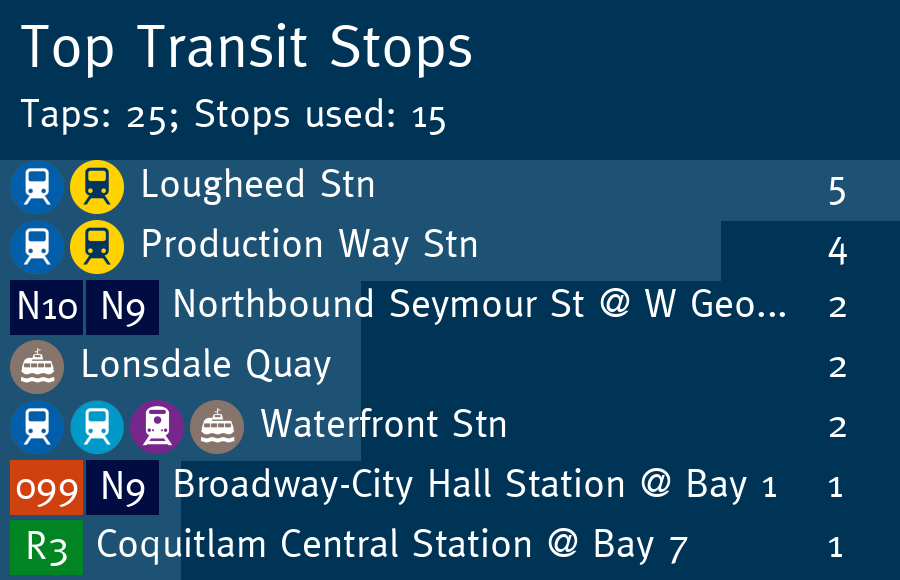

# Retraceit
A beautiful way to analyze your transit usage.



# Prerequisites
## Dependencies
A modern version of Python and the PIL (Pillow) library is needed. Assuming you
have Python installed, you can install PIL with the following command:

```bash
$ python3 -m pip install pillow
```

Additionally, if you want to run the Discord bot frontend, your will need to
have py-cord installed:

```bash
$ python3 -m pip install py-cord
```

## Environment Setup
First, you will need to setup a few environment variables in `retraceit.env` :

 * `RETRACEIT_IMGDIR`: point this variable to a directory containing service
  bullets (in 54x54px format).
 * `RETRACEIT_FNTFILE`: point this variable to the font you want to use for
  text in the generated images
 * `RETRACEIT_TRANSLINK_GTFSDIR`: To load in schedule information for the
   TransLink transit system, download a GTFS archive from
   [here](https://www.translink.ca/about-us/doing-business-with-translink/app-developer-resources/gtfs/gtfs-data)
   and extract it to a directory pointed to by this variable. The application
   will work without this variable set, but you'll only get the stop id for
   bus stops and no route information.
 * `RETRACEIT_HEADER_LOGO`: a square image which will be placed at the
   top-left corner of generated images if defined. 

Additionally, if you want to use the Discord bot frontend, you will need to
define the following variable:

 * `RETRACEIT_TOKEN`: the token for your Discord bot you want to run Retraceit
    on

Once these variables are set up in `retraceit.env`, activate them in your shell
by sourcing the file:

```bash
$ source retraceit.env
```

# Usage
## Python Library
I'm still cleaning up the interface a bit, so documentation coming soon!

## Frontend Server (Discord bot)
Simply run the provided `run-server.py` script - as lone as your environment is
set up correctly, there is nothing else needed!

```bash
$ python3 run-server.py
```

# Disclaimer
Route and arrival data used in this product or service is provided by permission of TransLink. TransLink assumes no responsibility for the accuracy or currency of the Data used in this product or service.

We are not affiliated with TransLink or any transit agency in any way.

# Image credits
 * SeaBus bullet -> Northwest, CC BY-SA 4.0 <https://creativecommons.org/licenses/by-sa/4.0>, via Wikimedia Commons
 * WCE bullet -> Northwest, CC BY-SA 4.0 <https://creativecommons.org/licenses/by-sa/4.0>, via Wikimedia Commons
 * Expo line bullet -> Northwest, CC BY-SA 4.0 <https://creativecommons.org/licenses/by-sa/4.0>, via Wikimedia Commons
 * Millennium line bullet -> Northwest, CC BY-SA 4.0 <https://creativecommons.org/licenses/by-sa/4.0>, via Wikimedia Commons
 * Canada line bullet -> Northwest, CC BY-SA 4.0 <https://creativecommons.org/licenses/by-sa/4.0>, via Wikimedia Commons

The header image provided in this README was produced by Retraceit and is licensed under CC BY-SA 4.0
